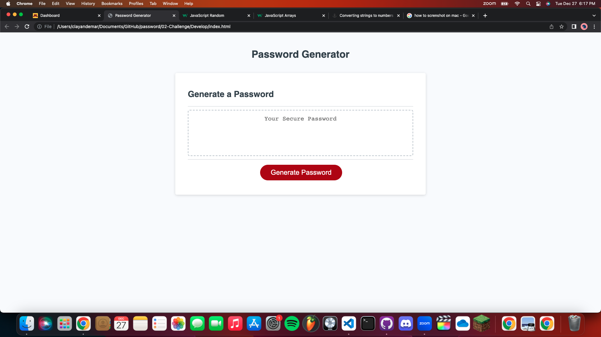

# 03 JavaScript: Password Generator

## User Story

```
AS A student who uses many different websites which require you to make an account
I WANT to be able to generate a secure password that fits the webiste's criteria
SO THAT I can be confident in my account's security and be able to own a unique password
```

## Acceptance Criteria

GIVEN I need a new password for an account
WHEN I click the button to generate a password
THEN a pop up screen asks me how many characters I'd like my password to be
WHEN I put in my answer
THEN another window pops up asking if I'd like lower case letters (and this repeats for upper case letters, numbers, and special characters)
WHEN I submit my answers
THEN a unique password that fits all the criteria will be generated for me

## Mock-Up

The following image shows the web application's appearance and functionality:


 
